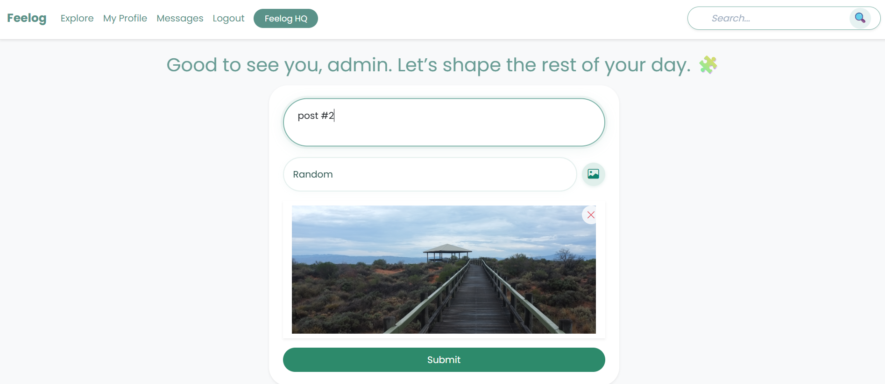

# Feelog — *feel + log*

> *Log what you feel, not just what you do.*

Feelog is a minimalist, clean, and distraction-free emotional logging platform designed to help users capture their thoughts and moods — and share them in a calm, expressive environment.

Built with a robust Flask backend, it balances personal journaling and social expression through a serene UI.  
You can **socially interact with others** through a **simple, distraction-free interface**.

---

## 🚀 Why Feelog?

I built Feelog as a personal challenge — a full-stack Flask project that tackles real design and architectural decisions. But more than that, I wanted to explore:

> How can we blend emotional reflection with digital expression —  
> without the noise of typical social media?

Feelog is that answer. No algorithm. Just feelings, shared consciously.

---

## ✨ Features

### Post & Feed Features
- Create posts with support for tags and image uploads
- Live image preview before posting
- Infinite scroll on home and explore pages (using IntersectionObserver API)
- Reactions: "Cheers" (like) and "Boos" (dislike)
- Threaded comment system
- Edit, soft-delete, and view post details
- Tag-based categorization and search
- Home feed shows posts from followed users

### User Profile & Social
- Follow/unfollow system with personalized feed
- User profiles with:
  - Profile photo (default + editable)
  - Editable bio, username, and info
  - "Last seen" visibility
- "Explore" page to browse public content

### Messaging & Interaction
- Private messaging system
- Database-backed chat
- Notification badge for unread messages

### Authentication & Security
- Full DB-backed authentication with login, logout, and registration
- Google SMTP-based password reset with secure token
- CSRF protection on all forms
- JWT token handling for password resets
- Random-page hyperlink and route protection

### Admin & Moderation
- Admin dashboard with stats and controls
- Promote users to admin with a single click
- Ban users — auto-hides their posts and comments
- Full moderation capabilities for posts and users

### UI/UX & Frontend

- Animated loaders and transitions
- Smooth, proffesional interface
- Custom 404 and error pages

---

## ⚡ Technical Highlights

- **Blueprints**: Modular Flask structure using Blueprints for clean separation
- **Search**: Full-text powered by Elasticsearch with graceful fallback handling
- **Realtime Feed**: Infinite scroll via IntersectionObserver + `fetch()` API
- **Database Event Hooks**: Auto-sync search index using SQLAlchemy event listeners
- **Image preview**: Image preview for posting from FileReader API
- **Security Enhancements**:
  - CSRF protection via Flask-WTF
  - JWT token use for password resets
- **Post Indexing**: SearchableMixin abstraction for syncing posts with Elasticsearch
- **Graceful Fallbacks**: Runs with or without Elasticsearch/Docker; warns if missing

---

## ⚙️ Tech Stack

- **Backend**: Flask, SQLAlchemy
- **Frontend**: Jinja2, Bootstrap 5, custom SCSS/CSS
- **Search**: Elasticsearch (Dockerized or optional local setup)
- **Database**: SQLite / PostgreSQL
- **Auth**: Flask-Login, JWT tokens
- **Messaging**: DB-based messaging

---

## 🛠️ Run Locally

You can either run Feelog using Docker or manually:

###  Option 1: Using Docker (Recommended – Full Features)

> Best for users who want the full Feelog experience including **search**, **messaging**, and **admin tools** — without setting up dependencies manually.

#### Step 1: Clone the Repository
```
git clone https://github.com/ancientlaw0/Feelog.git
cd Feelog
```
#### Step 2 (Optional but Recommended): Remove Previous Docker Cache
```
docker-compose down --volumes --remove-orphans
docker system prune -af
```


####  Step 3: Build & Run with Docker
```
docker-compose up --build
```
#### Step 4: Restarting Later?
```
docker-compose up
```

> Notes & Warnings

- Ensure Docker Desktop is running in the background before you run any commands.

- Elasticsearch will be accessible inside the app via the Docker network (e.g., http://elasticsearch:9200).

- The app will automatically wait for Elasticsearch to become healthy before launching.

- If .env is missing, it will be auto-copied from .env.example inside the Docker container.
- First-time build might take a couple of minutes.


---

### Option 2: Manual Setup (No Docker, No Search)

> Great for quick local testing, frontend tweaks, or development without needing Elasticsearch.

#### Step 1: Clone the Repository

```
git clone https://github.com/ancientlaw0/Feelog.git
cd Feelog
```

#### Step 2: Create & Activate Virtual Environment
```
python -m venv venv
source venv/bin/activate  ## On Windows: venv\Scripts\activate
```
#### Step 3: Install Dependencies
```
pip install -r requirements.txt
```
#### Step 4: Setup Your Environment
```
copy .env.example .env
```
#### Step 5: Editing env:
Edit your .env and make sure this line is either:
```
ELASTICSEARCH_URL=
```
or simply commented out like:
```
# ELASTICSEARCH_URL=http://elasticsearch:9200
```

#### Step 6: Seed the Database (Admin User, etc.)
```
flask seed-admin
```
#### Step 7: Run the Flask App
```
flask run
```

> Notes
- Elasticsearch features (search, indexing) will be disabled.

- Other features like posting, messaging, reactions, comments, profiles, etc. will still work as expected.

- Any features that require current_app.elasticsearch will be skipped safely if search is unavailable
---

### Option 3: Hybrid Setup (Manual App + Dockerized Elasticsearch)

This approach runs **Flask manually** while letting **Elasticsearch run inside Docker** — giving you full search functionality without containerizing your whole app.


> Everything will as same as option 2 just follow this extra step after Step:3 

#### Extra step : Start Elasticsearch via Docker
```
docker run -d --name elasticsearch \
  -p 9200:9200 \
  -e "discovery.type=single-node" \
  -e "xpack.security.enabled=false" \
  -e "ES_JAVA_OPTS=-Xms512m -Xmx512m" \
  docker.elastic.co/elasticsearch/elasticsearch:7.17.17
```
> Run this only once. If you're running it again later:

```
docker start elasticsearch
```
To stop:

```
docker stop elasticsearch
```


---

### Basic Setup Notes

-  Don't remove the `ELASTICSEARCH_URL` variable completely — just leave it blank or comment it out if not using search.

- You need to go to the link  ``http://localhost:5000`` to access the app

- All data (posts, users, reactions) is stored inside Docker volumes. Deleting volumes will wipe your database.

- The search function is case sensitive by default 

- User uploaded profile pictures and post images are stored in the static/ directory — not in the database. Make sure to back this up if needed.
---
## Configuration

```
bash# Database
DATABASE_URL=sqlite:///app.db

# Web app access link- http://localhost:5000

# Search (Optional)
ELASTICSEARCH_URL=http://localhost:9200

# Email Configuration
MAIL_SERVER=smtp.gmail.com
MAIL_PORT=587
MAIL_USE_TLS=1
MAIL_USERNAME=your-email@gmail.com
MAIL_PASSWORD=your-app-password

```
---


### 📁 Project Structure
```
feelog/
├── app/ # Main Flask application
│ ├── __init__.py # App factory setup
│ ├── auth/ # Auth blueprint
│ ├── main/ # Main app logic (posts, feed, search)
│ ├── errors/ # Custom error handlers
│ ├── templates/ # Jinja templates (base, posts, auth, etc.)
│ ├── static/ # CSS, JS, images, gif
│ ├── utility/ # Helper functions / utilities
│ ├── models.py # SQLAlchemy database models
│ ├── email.py # Email logic (used for password reset)
│ ├── search.py # Elasticsearch integration
│ └── cli.py # Custom Flask CLI commands
│
├── config.py # App configuration (ENV, DB, keys)
├── requirements.txt # Python dependencies
├── entrypoint.sh # Docker entrypoint (sets up DB, starts server)
├── Dockerfile # Docker build file
├── docker-compose.yml # Docker Compose setup (Flask + Elasticsearch)
├── .env.example # Sample environment configuration
├── wsgi.py # WSGI entry point for Gunicorn
├── LICENSE # App license (MIT)
└── README.md # Project documentation

```

---

### 👨‍💻 Built With & By

Feelog was built entirely solo as a passion project to explore full-stack development hands-on. Every feature — from database models to Elasticsearch integration, frontend design, and Docker deployment — was implemented by me from scratch.

This project was not just about writing code, but about learning to build a complete product: from problem-solving and debugging to design and deployment.

---

### Developer – Manas Gupta

- 🔗 [LinkedIn](https://www.linkedin.com/in/manas-gupta-857317318/)
- 📧 Email: [24ucs272@lnmiit.ac.in](mailto:24ucs272@lnmiit.ac.in)
- 🐙 [GitHub](https://github.com/ancientlaw0)
- 🐳 [Docker Hub](https://hub.docker.com/u/ancientlaw)

---

### 📸 Screenshots

#### Login


#### Home Feed


#### Post 


#### Comment


#### Post creation preview


#### User


#### Messaging Interface


#### Admin Dashboard


---

### Roadmap (v2 Plans)

Feelog isn’t done yet. A second version is being planned with a few practical improvements:

- API endpoint support for posts, users, messages (RESTful), with faster backend with FAST API
- In-app notifications for messages, comments, and reactions
- Mobile-friendly architecture 
- Optional OAuth login (Google/GitHub)
- Cleaner backend structure with more modularity

---

## Found a Bug?

Please create an issue describing the problem, steps to reproduce, and any error messages if available.

---

# 📃 License

This project is licensed under the [MIT License](./LICENSE).  
